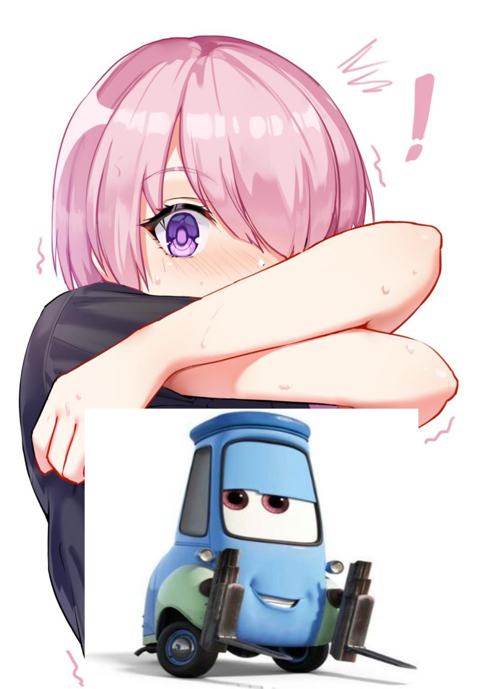

import SpoilerTag from "@components/SpoilerTag";

export const year = new Date().getFullYear();

É realmente necessário ter um blog em {year}? Porque não apenas postar no Medium, Dev.to? Ou usar uma rede social? Porque se dar ao trabalho de criar um blog do zero?

## Blogs e Redes Sociais
Para responder as perguntas acima, vou fazer um paralelo entre blog e rede social. E também responder do porque eu decidir criar um blog.

### Blogs
- **Controle**: Você tem controle total sobre o conteúdo, layout e funcionalidades.
- **Personalização**: Você pode personalizar o blog do jeito que quiser.
- **SEO**: Blogs são ótimos para SEO, você pode otimizar o blog para motores de busca (não tenho certeza).
- **Aprendizado**: Você aprende muito ao criar um blog do zero.
- **Portfólio**: Um blog pode ser um ótimo portfólio.

### Redes Sociais
- **Alcance**: Redes sociais tem um alcance maior.
- **Facilidade**: É mais fácil postar em redes sociais.
- **Engajamento**: Redes sociais tem mais engajamento.
- **Descoberta**: É mais fácil ser descoberto em redes sociais. 

### Um rede social me parece melhor
Sim, redes sociais no geral são melhores em muitos pontos, inclusive, você pode usar uma rede social como seu "blog".

No entanto, as redes sociais tem um grande problema: **Você não tem controle**. Você não tem controle sobre nada, o algoritmo pode mudar a qualquer momento, sua conta pode ser banida, você pode perder todo o conteúdo.

Isso nao significa que um blog é um lugar que voce pode fazer qualquer coisa, como crime, discurso de ódio, etc. Mas você tem controle sobre o conteúdo, você pode fazer backup, você pode mudar de servidor, você pode fazer o que quiser.

Por exemplo, posso enviar um NSFW aqui, olhe: 
<SpoilerTag type="image">

</SpoilerTag>

Ok, esse não foi o melhor exemplo, mas você entendeu.

### Porque eu decidi criar um blog?
Se eu fosse resumir, diria que foi pelos motivos acima. Eu quero ter controle sobre o conteúdo, eu queria  aprender a criar um blog do zero, eu quero ter um portfólio, eu quero ter um lugar onde eu possa postar o que eu quiser sem me preocupar com algoritmos.

Mas minha motivação veio de outro blog que li, onde o autor falava sobre como ter um blog era ter um pedaço seu na internet só seu, livre das amarras que as  redes sociais nos impõe. 

O autor citava casos que perdeu tudo por causa de mudanças de diretrizes da rede social, além de outros problemas. E ele também falava sobre toda a liberdade que um blog te dá.

Um lugar onde você pode ser você mesmo, sem se preocupar com likes, compartilhamentos,  opinião de pessoas aleatórias, etc.

Isso me motivou bastante, mesmo não tendo esses problemas. E aqui estou eu, também criando um pequeno pedaço na internet que posso chamar de meu.

Mas teve outro motivo também, queria aprender a **codar** um blog, e no processo, acabei aprendendo sobre muitas tecnologias e formas de criar um blog estático.

Pensei também em criar um blog dinâmico, mas entraria muita complexidade, como banco de dados, backend, além de segurança e manutenção.

Levando isso em consideração, me pareceu melhor criar um blog totalmente estático, até porque eu não preciso realmente de um blog dinâmico, eu só quero postar meus pensamentos.

Por fim, esse blog é um experimento, um teste, um aprendizado, um portfólio, meu laboratório particular.

**Extra:** aqui nesse blog,  há alguns egg easter, veja se consegue encontrar todos.

###  Medium, Dev.to, TabNews, etc
Diferente das redes sociais, essas plataformas são mais parecidas com um blog, ótimo para voce compartilhar seus conhecimentos, artigos, tutoriais, etc.

Então se eu conseguir te dar pelo menos um motivo para criar um blog, mas não quer criar um do zero, use uma  dessas plataformas. No fim, acredito que o importante é compartilhar conhecimento.

## Conclusão
Se você chegou até aqui, obrigado por ler até o final. Espero que tenha te dado pelo menos um motivo para criar um blog, ou pelo menos, te feito pensar sobre o assunto.

Por ultimo, tenho pergunta para você: Por que você tem um blog? Ou por que você não tem um blog? estou curioso para saber sua opinião.

***

Próximo artigo: [Como criar um blog do zero com Gatsby](/posts/como-criar-blog-com-gatsby) em breve.